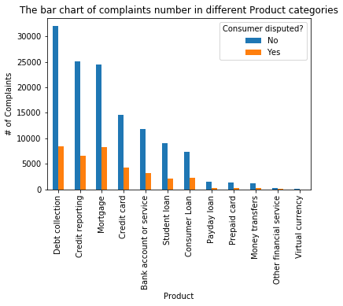
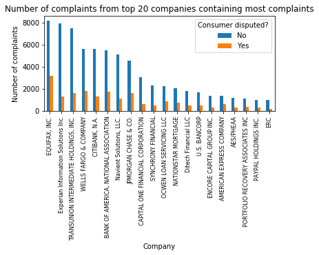
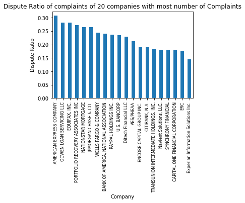
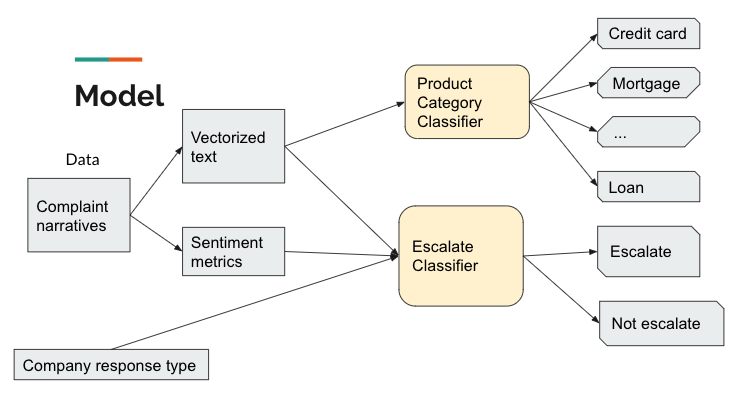
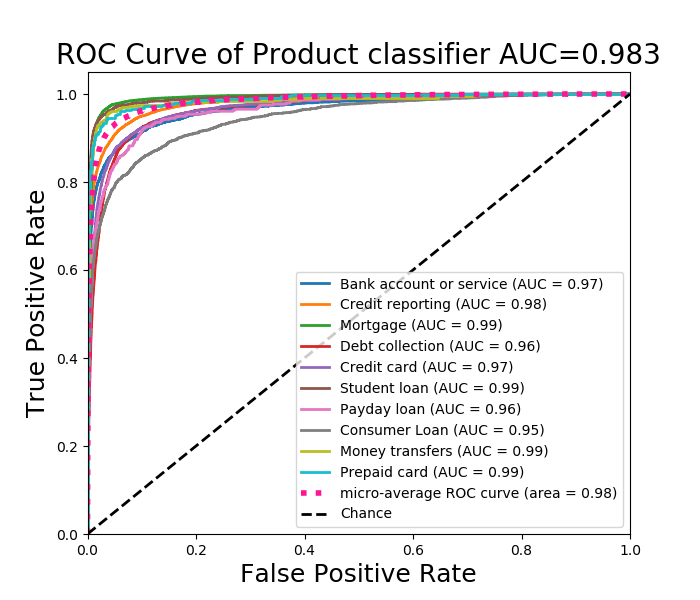
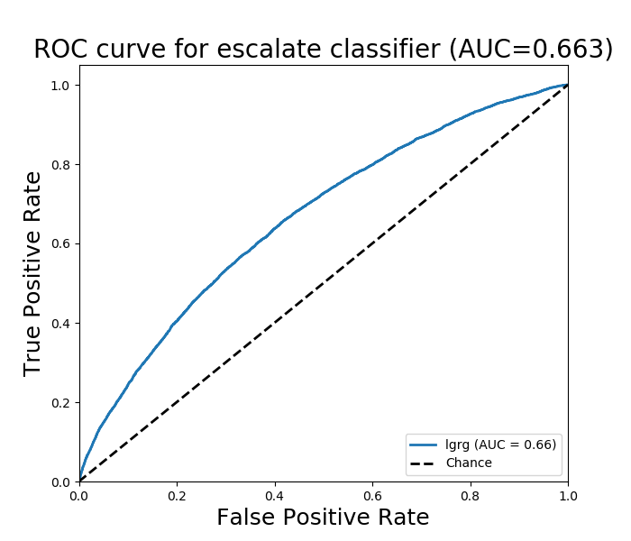

# Complaint Assistant

## Problem
Every company receives complaints, however, if complaints escalate and are not 
detected timely, it might cause huge money loss. In 2011, a guy sued Bank of 
American asking for 1784 billion, trillion dollars, which is more than the 
GDP of the WHOLE planet.  This ridiculous lawsuit starts just from several 
frustrating phone calls he made to settle some incorrectly deposited checks. 
Except for these extreme case, complaint escalation might make 
you company lose your customer or ruin your reputation.   

## Solution
[Complaint Assistant](http://complaintassistant.best) is web app leveraged by machine learning and NLP techniques
 that use historical customer complaint data to predict complaint escalation and 
suggest better response type.  Given a complaint narrative, **Complaint Assistant**
will give the probability of escalation given different response type.  A response
type with lowest escalation chance will be recommended. 

This repository is more related to model built and result analysis. The contents 
of web app built using Flask are in repository https://github.com/atuSpirit/ComplaintAssistantApp

The up-to-date presentation slides of this project is [here](https://docs.google.com/presentation/d/1szLrgJknFGfscOqPvCZzJ20DIQuZvPTD_omugdjrqSE/edit?usp=sharing)

## Website
[http://complaintassistant.best](http://complaintassistant.best)

### Data
The data I use is a historical consumer complaints database on US government website.
It contains more than 160k consumer complaints with narratives and labels.  For each
narrative, it contains the complaint narrative, product category it is about, how the
company response and what is the dispute result. 

#### Explorative Data Analysis
The data set contains customer complaints about financial produce and services. The 
number of complaints and the number of escalated complaints are summarized in the following
chart:

**Debt collection**, **Credit reporting** and **Mortgage** are the top 3 products with 
most number of complaints in this data set.

Let's first take a look at which companies have the most complaint. 

But wait, some companies have more complaints just because they are bigger and providing more 
services than others. So we should also aim at the ratio of the complaints resulted in dispute.
 

I noticed the company "Experian Information Solutions Inc".  It has the second most number of 
complaints, but its escalation ratio is the lowest among these 20 companies containing most 
complaints. Every company receives complaints, what is important is how you deal with these 
complaints. 

So I build a system to predict the probability of customer complaint escalation when the companies
adopt different responses. 

### Flowchart

Complaint_Assistant_Demo.pdf contains detailed explanation.

### Main contents in this repository
- Complaint_Assistant_Demo.pdf
    the explanation of the model process
    
- DataCleaning.py  
    dealing with missing data
    Complaints data with no narrative and no labels are removed.
    
- SentimentMetricGenerator.py
    For each narrative, generate eight sentiment metrics based on sentiment score
     of sentence reported by Vader.
    The eight metrics are:
     
    
- TextPreprocess.py
    the NLP pre-processing of the narratives, including 
         tokenization
         lemmatization
         build customized stop word library, removing stop word with strong sentiment, say, Shouldn't, never
         
- ProductClassifier.py
    the multi-class classifier which will predict a complaint’s product category.  
    Whether does a complaint belong to mortgage or loan or credit card? 
    
- EscalationClassifier.py
    the binary classifier to predict whether a complaint will escalate or not. 
    
- Predict.py
    based on the trained model, predict complaint product category and chance of
    escalation
    
## Results
- The AUC score of Product Category Classifier is 0.98.

- The AUC score of escalation classifier is 0.648

- Validation on 1,000 mostly submitted complaints.

More than 60% of the escalations are detected. Almost all of them have a suggested
response type different from the currently used one.  It means, 
half of the escalations could be eliminated at the beginning!!

## Future Plan
The AUC score of escalation classifier is inferior to that of product category 
classifier.  Escalation classifier is a more complicated problem, which need to 
detect more negative complaints out of negative complaints. Two parts can be 
improved. 

- more accurate sentiment analysis

    Currently, I used Vader as the sentiment analysis package. However, its 
    performance is far from enough to catch negative complaint.  I will try
    to use train my own sentiment analysis model, maybe based on Bert.
    
- incorporate more semantic information

    TF-IDF model is used to do word embedding.  It is more word based model, 
    although I used ngram = (1, 3) to include some context information. However, 
    the complex of the problem need more semantic information. I tried Doc2Vec
    model in genism, it didn't reach a better result. I will do more fine tune
    on it.  Bi-LTSM is the next trial direction. 
    
- generate dangerous word library

    Some informative words with strong sentiment, like "never", "shouldn't" might be 
    buried in words describing product category or issue. Extracting words which 
    most differentiate more negative complaints from negative complaints seems to 
    be a promising direction. 
